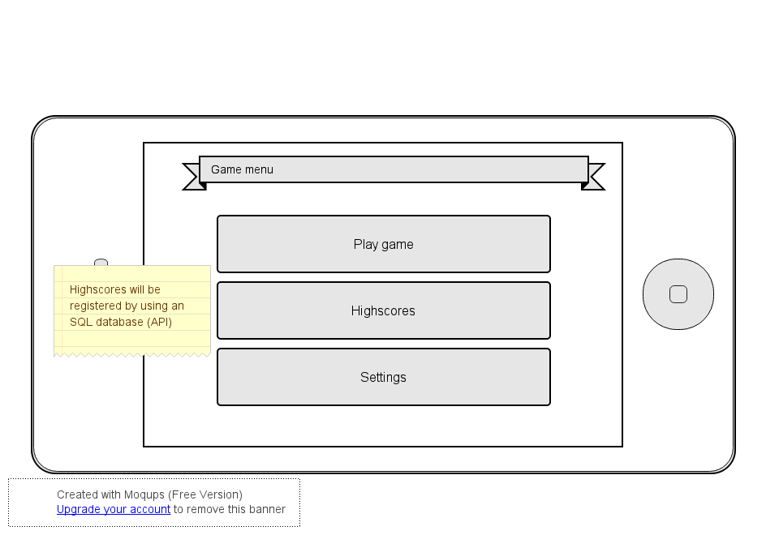

MageFighters - Kishan Nirghin 10823778
=============
###Ik heb nog te weinig research gedaan om nu al weten hoe ik alle methodes ga maken. En meestal kom ik er doende weg achter hoe ik het wil aanpakken.
###Voor een echte lijst met alle classes en methodes, zie de code!

##a list of classes and public methods (and their return types and/or arguments) that you’ve decided to implement
###MainMenu class
- Dit is het scherm die elke nieuwe gebruiker op het begin te zien krijgt
```java
//zet de contentView
public void onCreate()

//verandert de activity naar gameActivity
public void startGame()

//verandert de activity naar highscoreActivity
public void viewHighScore()

//verandert de activity naar settingsActivity
public void settings()
```

###highscoreActivity class
```java
public void getHighscores()
```

###settingsActivity class
```java
public void setVolume(int volume)
public void resetGame()
public void goBack()
```

###GameActivity class
- Is de activity die de gameView maakt
```java
//set de contentView op new GameView, of een opgeslagen gameView
public void onCreate()

//moet de huidige gameView state opslaan en de activity sluiten
public void onBackPressed()

```

###GameView class
```java
//Moet alle objecten updaten
void Update()

//Moet alle objecten tekenen
protected void onDraw(Canvas canvas)

//Houd bij op welke knoppen er gedrukt zijn
public boolean onTouchEvent(MotionEvent ev)
	return true;
```

###GameLoopThread class
```java
//is de thread die de framerate constant probeert te houden
public void run()

//zorgt er voor dat er geen updates vanuit run() naar de canvas worden gestuurt
public void setRunning(boolean run)
```

###Player
```java
//update de spelers positie elke frame
public void update()

//functies spreken voor zich
public void moveLeft()
public void moveRight()
public void stop()
public void jump()
public void attack()

//geeft een rectangle terug voor collision detection
public void getRect()
```

###Button
```java
public boolean isTouched()
public boolean isPressed()
public boolean isReleased()
public void getRect()
```

###Attack
```java
public void update()
public void isVisible()
```

###Enemy
```java
public void handleCollision(Attack attack)
public void update()
```

##more advanced sketches of UIs that clearly explain which features are connected to which underlying classes;
 


##a list of APIs and frameworks that you will be using to provide functionality in your app;
- API om highscores op te slaan in een SQLite database
- API om ervoor te zorgen dat 'geschud' herkent word, dus een soort van motionsensor

##a list of database tables and fields (and their types) that you’ve decided to implement (if needed).
- Datatable met de volgende colomns: id, timestamp, ip_addr, name, score, game_version 
